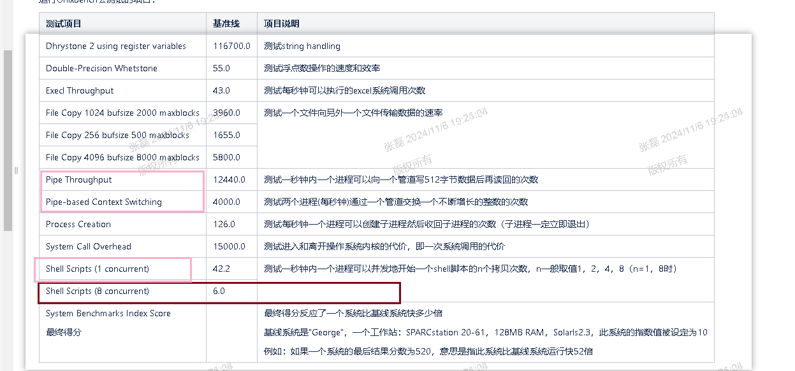

mark  furina 

结论 内核版本不行 更新内核版本之后性能好很多

当时的情况是这个样子的 

5点钟的时候 我接到通知   客户现场的性能测试有问题 

情况是这个样子  物理机 h84r  vm  c79   存储分布式存储 

物理机跑分将近 1500   虚拟机跑分 1100  相差很大  

5点20的时候 我去远程  

1.  发现有很多性能的配置项没有开启 尝试开启之后  
2. 远程安装了SuperPI  一个单核的浮点计算  进行了验证之后  物理机  1<<24位 PI运算  49s  虚拟机 50s     
3. 同时使用mpstat来进行虚拟化的guest查看  基本跑满了 感觉就单核计算性能没有啥 差别啊想看一下UnixBench了 

块6点的时候 远程那边客户吃饭去了 没法远程了  

6点半的时候 又可以远程了  

去查看UnixBench的结果   不好   

去查看日志 逐步分析问题  下面的其实都比较差

拿这个地方其实就感觉是和系统之间的交互比较有问题了  毕竟之前验证过  浮点计算没啥损失的 

我想要去拿h84r跑一下 但是现场只有iso 拉vm比较慢  然后客户就下班了   远程就远程不了了 

下来之后    我需要在我们内部的环境上复现一下  

花了半个小时清理环境  和准备运行脚本  现在就8半多了

然后跑了半个小时去 跑  不过我自己也没有h84r的qcow2  去手动用iso拉了一个 又花了半个小时 

结论 内核版本不行 更新内核版本之后性能好很多

当时的情况是这个样子的 

5点钟的时候 我接到通知   客户现场的性能测试有问题 

情况是这个样子  物理机 h84r  vm  c79   存储分布式存储 

物理机跑分将近 1500   虚拟机跑分 1100  相差很大  

5点20的时候 我去远程  

1.  发现有很多性能的配置项没有开启 尝试开启之后  
2. 远程安装了SuperPI  一个单核的浮点计算  进行了验证之后  物理机  1<<24位 PI运算  49s  虚拟机 50s     
3. 同时使用mpstat来进行虚拟化的guest查看  基本跑满了 感觉就单核计算性能没有啥 差别啊想看一下UnixBench了 

块6点的时候 远程那边客户吃饭去了 没法远程了  

6点半的时候 又可以远程了  

去查看UnixBench的结果   不好   

去查看日志 逐步分析问题  下面的其实都比较差

拿这个地方其实就感觉是和系统之间的交互比较有问题了  毕竟之前验证过  浮点计算没啥损失的 

我想要去拿h84r跑一下 但是现场只有iso 拉vm比较慢  然后客户就下班了   远程就远程不了了 

下来之后    我需要在我们内部的环境上复现一下  

花了半个小时清理环境  和准备运行脚本  现在就8半多了

然后跑了半个小时去 跑  不过我自己也没有h84r的qcow2  去手动用iso拉了一个 又花了半个小时 