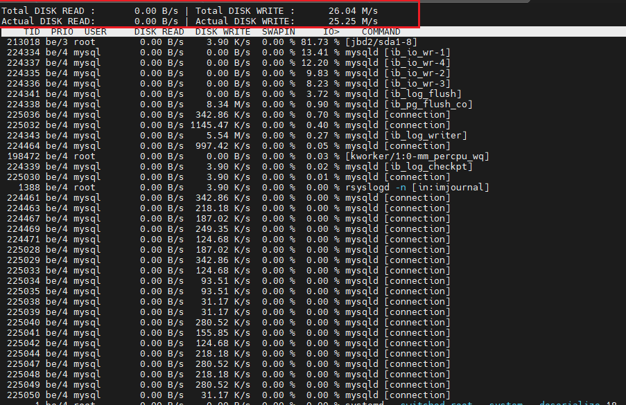
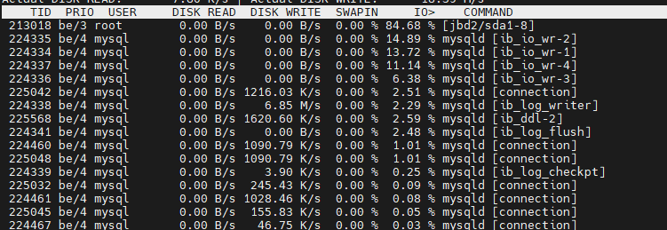

安装 

```
yum   install   iotop   -y
```

界面 

输入iotop之后进入类似top一样的界面



最上面的界面 

整个系统的读写带宽  如下图  在进行数据库写入测试的时候  系统实时的写入带宽差不多20M/S


下面的界面 




- **TID**: 线程ID (Thread ID)。显示该活动对应的线程ID。
- **PRIO**: 优先级 (Priority)。显示线程的优先级。
- **USER**: 用户 (User)。显示执行该活动的用户。
- **DISK READ**: 磁盘读取速度 (Disk Read Speed)。显示该线程从磁盘读取数据的速率。
- **DISK WRITE**: 磁盘写入速度 (Disk Write Speed)。显示该线程向磁盘写入数据的速率。
- **SWAPIN**: 交换 (Swap In)。显示该线程从交换分区中调入数据的百分比。
- **IO%**: I/O等待时间百分比 (I/O Wait Time Percentage)。显示该线程的I/O操作占用的CPU时间百分比。
- **COMMAND**: 命令 (Command)。显示执行该操作的命令或进程

待完善
