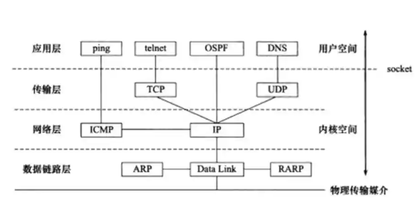
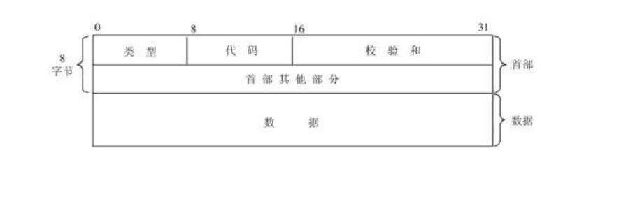
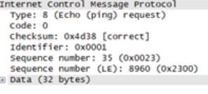
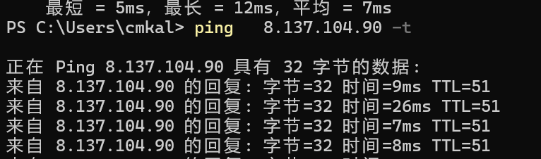

ping命令是我们平常用来检测网络通不通的  他依赖ICMP  如图所示

ICMP是IP层的一个小协议  IP层的协议是这个

IP协议（网际协议），ICMP协议（Internet互联网控制报文协议），以及IGMP协议（Internet组管理协议）。

ICMP 

ICMP是IP协议的附属协议。IP层用它来与其他主机或路由器交换错误报文和其他重要信息。尽管ICMP主要被IP使用，但应用程序也有可能访问它。Ping和Traceroute，就都使用了ICMP。

ICMP的地位有点尴尬的  因为我看书上说他是IP层的协议 但是其实就报文来说   

ICMP是被封装在IP数据报的里面

报文格式这个样子的

ping操作的icmp报文就只有两种，**请求****(request)**和**应答****(reply)**。这两个报文的type不一样，8代表请求，0代表应答；code都为0，表示为回显应答；标示符和序列号都是一样的，表示这两个报文是配对的。

如何长ping 

linux的ping默认是长ping  

win默认是短ping 

显式开启长ping   -t参数使用

其他想要更多自定义的使用ICMP来的话的ping的话  ping提供的参数并不多  可以使用hping看能不能满足需求

待完善
